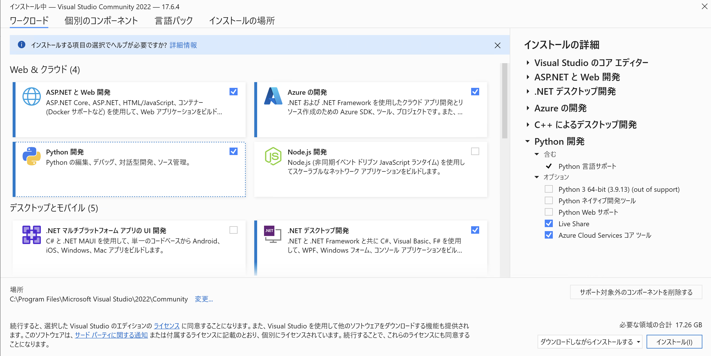
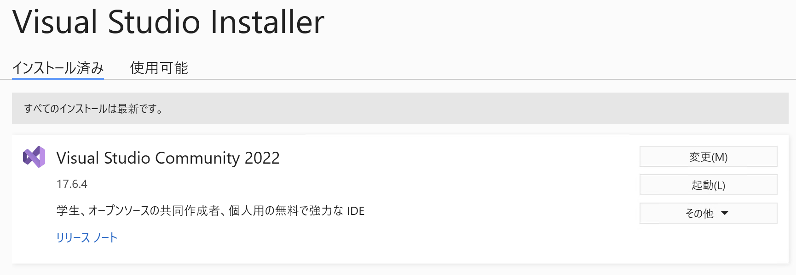

# windowsへのROOT6ダウンロード
ver6.26.02以降64bitのROOT6がwindowsに対応している。(WSLを用いなくてもwindows上で64bitで動く！)

## 1. Visual Studio 2022のダウンロード
**Warning** Visual Studioのインストールに15~20GBの空き容量が必要
1. https://visualstudio.microsoft.com/ja/downloads/ よりVisual Studio 2022をダウンロードする。**Communityでよい。**
2.  ダウンロードを押すとVisualStudioSetup.exeがダウンロードされるので実行する。
3. 下の画面までいけたら「C++によるデスクトップ開発」にチェックを入れ、(それ以外は何でもいい)右下のインストールを実行。インストールには十分程度かかる。

4. 下の画面までいけば完了。


## 2. ROOTのインストール(exeを入れる方法)
1. https://root.cern/install/all_releases/ から入れたいバージョンを選ぶ。
2. プラットフォームごとに様々なファイルが並んでいるが、一番下の方の「Windows Visual Studio 2022 64-bit x64」の「root_v6.??.??.win64.vc17.exe(?にはバージョン番号が入る)」を開く。
3. ダウンロードできたら実行する。「WindowsによってPCが保護されました」という画面が出たら「詳細情報」->「実行」。(決してウイルスを検知しているわけではなく単に発行元不明のアプリを警戒しているだけ)
4. セットアップアプリが立ち上がったら「次へ」を連打してインストールする。ちゃんとしたい人は中身を読んでから「次へ」を推した方がいい。
5. セットアップの完了という画面が出たらひとまずOK。

## 2. ROOTのインストール(zipを入れる方法)
1. https://root.cern/install/all_releases/ から入れたいバージョンを選ぶ。
2. プラットフォームごとに様々なファイルが並んでいるが、一番下の方の「Windows Visual Studio 2022 64-bit x64」の「root_v6.??.??.win64.vc17.zip(?にはバージョン番号が入る)」を開く。
3. zipファイルがダウンロードできたら展開する。展開先はどこでもいいがCドライブ直下を推奨。
4. 「root」というフォルダの中にファイルが入っている状態になるが、バージョン情報がわからなくなるので「root_v6.??.??」に名前を変えておく。

## 3. PATHを通す
- 単純に使うだけであればシステム環境変数に「C:¥root_v6.??.??¥bin」を追加すれば良い。

- ROOT5とROOT6が共存するような環境では上記のやり方が使えない。「C:¥root_v6.??.??¥bin¥thisroot.bat」を実行するとPATHが追加される。
```
C:¥Users¥user>root
'root' は、内部コマンドまたは外部コマンド、
操作可能なプログラムまたはバッチ ファイルとして認識されていません。

C:¥Users¥user>C:¥root_v6.26.02¥bin¥thisroot.bat

C:¥Users¥user>root
   ------------------------------------------------------------------
  | Welcome to ROOT 6.26/02                        https://root.cern |
  | (c) 1995-2021, The ROOT Team; conception: R. Brun, F. Rademakers |
  | Built for win64 on Apr 12 2022, 16:28:03                         |
  | From tags/v6-26-02@v6-26-02                                      |
  | With MSVC 19.31.31104.0                                          |
  | Try '.help', '.demo', '.license', '.credits', '.quit'/'.q'       |
   ------------------------------------------------------------------

root [0]
```
- 上記のやり方ではコマンドプロンプトを開き直すたびにthisroot.batを呼び出さなければいけない。そこで、コマンドプロンプトを開く時に自動で呼び出すような設定の仕方を以下に記す。
    - C:¥Users¥userに「SetEnv.bat」を作成
    - SetEnv.batを右クリックして「編集」 。下のように書いて保存(ROOTのバージョンはインストールしたものに合わせる)
        ```
        @echo off
        call C:¥root_v6.26.02¥bin¥thisroot.bat
        ```
    - コマンドプロンプトのアプリケーションを右クリックし「プロパティ」->「ショートカット」の「リンク先」の`・・・cmd.exe`の後に`/k C:¥Users¥user¥thisroot.bat`を追加する。<br>
    これでコマンドプロンプトを開くたびに「SetEnv.bat」が呼び出される

## 追伸
公式サイトのインストール方法(https://root.cern/install/)を読むと、CMakeやPythonも入れなければならないと書いてある。CMakeは無くても動いている。Pythonが無い場合は未検証。